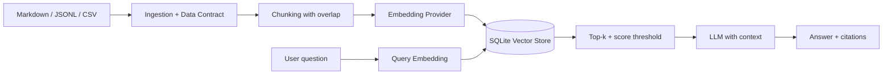

# RAG Data Platform

> Production-minded reference project: data engineering pipeline + Retrieval-Augmented Generation, built in Python.

[](https://www.python.org/)
[](https://fastapi.tiangolo.com/)
[](./tests)

## Why this project

This repository demonstrates a reproducible end-to-end workflow:

1. ingestion of Markdown, TXT, JSON, JSONL, and CSV files;
2. normalization and data contracts with `content_hash`;
3. deterministic chunking with overlap;
4. embedding computation and persistence;
5. retrieval with cosine similarity;
6. grounded generation with verifiable citations;
7. REST API, CLI, pipeline metrics, and automated tests.

The default mode requires no API key: it uses hash embeddings and an extractive generator. For an LLM demo, enable the OpenAI providers through `.env`.

## Architecture



## Quickstart

```bash
git clone https://github.com/matteospata/rag-data-platform.git
cd rag-data-platform
python -m venv .venv
source .venv/bin/activate
pip install -e '.[dev]'
cp .env.example .env
python -m rag_platform.cli ingest --path data/knowledge_base
python -m rag_platform.cli ask "What makes a reliable RAG system?"
```

Start the API:

```bash
uvicorn rag_platform.api:app --reload
curl -X POST http://localhost:8000/query \
  -H 'Content-Type: application/json' \
  -d '{"question":"How does the pipeline work?"}'
```

Or:

```bash
docker compose up --build
```

## Production providers

Install the OpenAI client:

```bash
pip install -e '.[llm]'
```

Set the following values in `.env`:

```dotenv
OPENAI_API_KEY=...
RAG_EMBEDDING_PROVIDER=openai
RAG_EMBEDDING_MODEL=text-embedding-3-small
RAG_LLM_PROVIDER=openai
RAG_LLM_MODEL=gpt-4o-mini
```

For local embeddings:

```bash
pip install -e '.[local]'
RAG_EMBEDDING_PROVIDER=sentence_transformers
```

## API

| Method | Endpoint | Purpose |
|---|---|---|
| `GET` | `/health` | service health and active providers |
| `POST` | `/ingest` | index a file or directory |
| `POST` | `/query` | retrieval + answer + citations |
| `GET` | `/documents` | indexed documents |

## Engineering decisions

- Idempotency: unchanged content is not embedded again.
- Traceability: every chunk preserves `source`, title, index, and metadata.
- Grounding: the prompt requires the model to answer only from context and admit when evidence is missing.
- Portability: the local core is inspectable in SQLite and the provider is replaceable.
- Testability: tests use only local dependencies and require no network or credentials.

For production, the natural next upgrade is replacing the brute-force retriever with pgvector, Qdrant, or Milvus, adding reranking, and introducing an evaluation dataset with hit-rate@k, MRR, faithfulness, and answer relevancy.

## Testing and quality

```bash
make test
make lint
```

## Suggested LinkedIn post

> I built a RAG Data Platform in Python: an ETL/ELT pipeline that ingests documents, applies data contracts, chunking, and embeddings, indexes content, and generates grounded answers with citations. The project includes a FastAPI API, CLI, Docker, idempotent indexing, and tests that run without an API key. The next step is automated evaluation and a distributed vector database.

## License

MIT.
